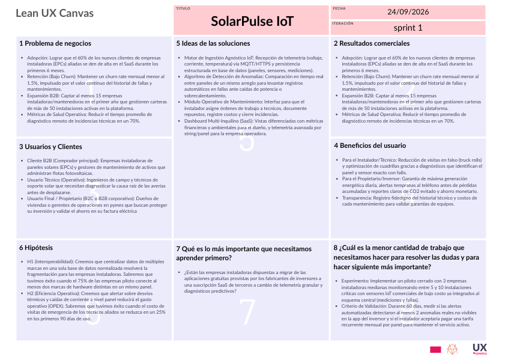

  

---

<strong><big>Universidad Peruana de Ciencias Aplicadas</big></strong>

<strong>Ingeniería de Software</strong>

<strong>Ingenieria de Sistemas de Información</strong>

<strong><big>Periodo: </big></strong>2026-20

<strong><big>Curso: </big></strong>1ASI0787 | Base de datos

<strong><big>NRC: </big></strong>15869

<strong><big>Docente: </big></strong> Rafael Oswaldo Castro Veramendi

---

<strong><big>Informe del Trabajo Final</big></strong>

<strong><big>Nombre del startup</big></strong> Heliosync Technologie

<strong><big>Nombre del producto</big></strong> SolarPulse IoT

<strong><big>Relacion integrantes</big></strong>

| Código     | Apellidos y Nombres                   |
|------------|---------------------------------------|
| U20211A574 | Navarro Flores Renzo Jesus            |
| U20221f624 | Bravo Castillo Rojo Miguel Alejandro  |
| U20241B647 | Quispe Vargas Juan Carlos             |
| U202410464 | Martínez Zeta José Alonso             |
| U20221A006 | Soto Vásquez, María Fernanda          |

# Registro de versiones

<table>
    <thead>
        <tr>
            <th>Versión</th>
            <th>Fecha</th>
            <th>Autores</th>
            <th>Descripción de modificaciones</th>
        </tr>
        <tbody>
            <tr>
                  <td rowspan="5" style="text-align: center; vertical-align: middle;"><b>TP1</b></td>
                  <td style="vertical-align: middle;">14/09/2026</td>
                  <td>
                    <ul style="margin: 0, padding-left: 20px;">
                    <li>Renzo Jesus, Navarro Flores</li>
                    <li>Miguel Alejandro, Bravo Catillo Rojo</li>
                    <li>Juan Carlo, Quispe Vargas</li>
                    <li>José Alonso, Martínez Zeta</li>
                    <li>María Fernanda, Soto Vásquez</li>
                    </ul>
                  </td>
                  <td>Desarrollo de nuestro diseño complementario de la base de datos de SolarPulse IoT en base a las entrevistas obtenidas, se plantea el diseño del diagrama de entidad-relación lógico, diagrama de entidad-relación físico y se determina que software de base de datos vamos a usar</td>
            </tr>
        </tbody>
    </thead>
</table>

# Project Report Collaboration Insights

**URL del repositorio del informe:** https://github.com/Renzo-J-Navarro/SolarPulse_IoT

### TP1

**Descripción de la colaboración en la elaboración del informe:**

Para el Trabajo Parcial, el equipo de SolarPulse IoT organizó la elaboración del informe mediante la asignación de tareas a cada integrante, distribuidas por capítulos y apartados. Se coordinaron los avances, se identificaron contenidos pendientes y se acordaron ajustes en las entrevistas, Requisitos funcional y no funcionales, diseños dos diagramas de bases de datos en .erd y diseñar del modelado fisico llevado SQL Server. Asimismo, se asignó la preparación de la carátula, el índice y la estructura del Student Outcome en el documento Markdown. Esta distribución de responsabilidades facilitó el seguimiento de las tareas y la integración de los aportes del equipo para la entrega.

# Tabla de Contenido

- [Registro de versiones](#registro-de-versiones)
- [Tabla de contenidos](#tabla-de-contenido)
- [Student outcome](#student-outcome)
- [CAPÍTULO I: INTRODUCCIÓN](#capítulo-i-introducción)
  - [Startup profile](#startup-profile)
    - [Descripción de startup](#descripción-de-startup)
    - [Perfiles de integrantes del grupo](#perfiles-de-integrantes-del-grupo)
  - [Solution Profile](#solution-profile)
    - [Antecedentes y problemáticas](#antecedentes-y-problemáticas)
    - [Propuestas de valor](#propuestas-de-valor)
  - [Segmentos objetivo](#segmentos-objetivo)
- [CAPÍTULO II: RECOPILACIÓN Y ANÁLISIS DE REQUISITOS](#capítulo-ii-recopilación-y-análisis-de-requisitos)
  - [Entrevistas](#entrevistas)
    - [Diseño de entrevistas](#diseño-de-entrevistas)
    - [Registro de entrevistas](#registro-de-entrevistas)
    - [Análisis de entrevistas](#análisis-de-entrevistas)
  - [Requisitos](#requisitos)
    - [Requisitos funcionales](#requisitos-funcionales)
    - [Requisitos No funcionales](#requisitos-no-funcionales)
- [CAPÍTULO III: DISEÑO DE BASE DE DATOS](#capítulo-iii-diseño-de-base-de-datos)
  - [Entidades](#entidades)
  - [Atributos](#atributos)
  - [Enfoque relacional](#enfoque-relacional)
    - [Diagrama entidad-relación lógico](#diagrama-entidad-relación-lógico)
- [CAPÍTULO IV: IMPLEMENTACIÓN DE BASE DE DATOS](#capítulo-iv-implementación-de-base-de-datos)
  - [Sistemas de gestión de base de datos](#sistemas-de-gestión-de-base-de-datos)
    - [Evaluación y elección del sistema de gestión de base de datos relacional](#evaluación-y-elección-del-sistema-de-gestión-de-base-de-datos-relacional)
  - [Diagramas de datos](#diagramas-de-datos)
    - [Diagrama entidad-relación físico](#diagrama-entidad-relación-físico)
- [Conclusiones](#conclusiones)
- [BIBLIOGRAFÍA](#bibliografía)
- [ANEXOS](#anexos)

    

# Student outcome

El curso contribuye al cumplimiento del Student Outcome ABET:

**ABET – EAC - Student Outcome 4**

**Criterio:** La capacidad de reconocer responsabilidades éticas y profesionales en situaciones de ingeniería y hacer juicios informados, que deben considerar el impacto de las soluciones de ingeniería en contextos globales, económicos, ambientales y sociales.

En el siguiente cuadro se describe las acciones realizadas y enunciados de conclusiones por parte del grupo, que permiten sustentar el haber alcanzado el logro del ABET – EAC - Student Outcome 4.

| Criterio específico | Acciones realizadas | Conclusiones |
| --- | --- | --- |
| 7.c1. Actualiza conceptos y conocimientos necesarios para su desarrollo profesional y en especial para su proyecto en soluciones de ingeniería de software. | **Navarro Flores, Renzo Jesus** **TP1:** lorem ipsum.  **Miguel Alejandro, Bravo Catillo Rojo** **TP1:** lorem ipsum.  **Juan Carlo, Quispe Vargas** **TP1:** lorem ipsum.  **José Alonso, Martínez Zeta** **TP1:** lorem ipsum.  **María Fernanda, Soto Vásquez** **TP1:** . | **TP1:** lorem ipsum. |
| 7.c2. Reconoce la necesidad del aprendizaje permanente para el desempeño profesional y el desarrollo de proyectos en soluciones de tecnologías de ingeniería de software. | **Navarro Flores, Renzo Jesus** **TP1:** Lorem ipsum.  **Miguel Alejandro, Bravo Catillo Rojo** **TP1:** lorem ipsum.  **Juan Carlo, Quispe Vargas** **TP1:** lorem ipsum.  **José Alonso, Martínez Zeta** **TP1:** lorem ipsum.  **María Fernanda, Soto Vásquez** **TP1:** lorem ipsum. | **TP1:** lorem ipsum. |

# CAPÍTULO I: INTRODUCCIÓN

## 1.1. Startup profile

En esta sección, se presenta una descripción detallada de la startup, incluyendo su misión, visión y valores fundamentales así como una descripción de los integrantes que la conforman.

### 1.1.1. Descripción de startup

Somos “Heliosync Technologie” una Startup de base tecnológica especializada en telemetría IoT y arquitecturas de datos en la nube para optimizar activos fotovoltaicos distribuidos en tiempo real.
|Misión|Visión|
|------|------|
|Maximizar la eficiencia operativa y el retorno de inversión de instalaciones solares residenciales, comerciales e industriales mediante la centralización de datos IoT, analítica predictiva y gestión automatizada del mantenimiento.|Consolidarse como el ecosistema estándar de observabilidad e inteligencia operativa para microrredes y sistemas solares distribuidos en América Latina, acelerando la transición hacia matrices energéticas descarbonizadas y confiables.|

### 1.1.2. Perfiles de integrantes del grupo

<table>
  <tr>
    <th colsan="2">Navarro Flores, Renzo Jesus</th>
  </tr>
  <tr>
    <td>
      
    </td>
    <td>
      <b>Codigo:</b> u20211a574 
      <b>Carrera:</b> Ingenieria de Software 
      Soy estudiante de Ingeniería de Software en la Universidad Peruana de Ciencias Aplicadas. Cuento con conocimientos de desarrollo de documentación, requisitos y requerimientos, arquitectura de software y manejo de redes con cisco packet tracer y arduino. Dentro de SolarPulse IoT, aportaré mi lógica de análisis para buscar vulnerabilidades en el sistema y preparar contramedidas, responsabilidad y trabajo colaborativo.
    </td>
  </tr>

  <tr>
    <th colsan="2">Bravo Castillo Rojo, Miguel Alejandro</th>
  </tr>

  <tr>
    <td>
      
    </td>
    <td>
      <b>Codigo:</b> u20221f624 
      <b>Carrera:</b> Ingenieria de Software 
      Estudiante de la carrera de ingeniería de Software siento que puedo aportar al equipo con mis conocimientos acerca ux/ui y conocimientos en el lenguaje de programación C++ además siendo autocrítico con nuestra iniciativa para asi poder alcanzar un alto grado de satisfacción en el proyecto.
  </tr>

  <tr>
    <th colsan="2">[Nombre del integrante 3]</th>
  </tr>

  <tr>
    <td>
      
    </td>
    <td>
      <b>Codigo:</b> [Codigo integrante 3] 
      <b>Carrera:</b> Ingenieria de Software 
      [Descripccion breve del las habilidades y aportes del integrante]
  </tr>

  <tr>
    <th colsan="2">[Nombre del integrante 4]</th>
  </tr>

  <tr>
    <td>
      
    </td>
    <td>
      <b>Codigo:</b> [Codigo integrante 4] 
      <b>Carrera:</b> Ingenieria de Software 
      [Descripccion breve del las habilidades y aportes del integrante]
  </tr>

  <tr>
    <th colsan="2">[Nombre del integrante 5]</th>
  </tr>

  <tr>
    <td>
      
    </td>
    <td>
      <b>Codigo:</b> [Codigo integrante 5] 
      <b>Carrera:</b> Ingenieria de Software 
      [Descripccion breve del las habilidades y aportes del integrante]
  </tr>

</table>

## 1.2. Solution Profile

En esta sección se describe el perfil de la solución propuesta, incluyendo los antecedentes y la problemática que aborda. Además, se usó la técnica de las 5W y 2H para comprender mejor el contexto y las necesidades del usuario. Finalmente, se desarrolló el proceso Lean UX para definir las posibles características y funcionalidades de la solución.

### 1.2.1. Antecedentes y problemáticas

#### A. Quiénes están involucrados (who)

Afecta principalmente a empresas instaladoras de paneles solares, técnicos de mantenimiento de campo y propietarios de activos fotovoltaicos (ya sean pymes comerciales o familias residenciales).

#### B. Qué problema resuelve la solución (What)

Existe una carencia de visibilidad operativa granular en los sistemas fotovoltaicos, lo que impide detectar a tiempo caídas de eficiencia y fallas tempranas en paneles específicos.

#### C. Cuándo ocurre el problema (When)

Ocurre de manera continua durante la operación diaria de los paneles solares, específicamente en el periodo entre que ocurre una falla silenciosa (como acumulación de suciedad o degradación térmica) y el momento en que se detecta en la facturación o revisión.

#### D. Dónde ocurre el problema (where)

En instalaciones de sistemas solares distribuidos en América Laina, con un enfoque inicial en Lima Metropolitana, donde factores climáticos como alta humedad, polvo y hollín urbano afectan los paneles.

#### E. Por qué es relevante este problema (Why)

Porque las soluciones actuales provistas por los fabricantes de inversores son cerradas, no interoperables y solo detectan anomalías a nivel macro. Esto oculta fallas individuales a nivel de panel y evita un diagnóstico preciso.

#### F. Cómo se gestiona actualmente el problema (How)

El problema se manifiesta mediante pérdidas energéticas que pasan desapercibidas y obligan a los instaladores a realizar visitas técnicas “a ciegas” para diagnosticar problemas en toda la red, saturando a las cuadrillas de mantenimiento.

#### G. Cuánto impacta el problema (How much)

- **Inversión:** Comprende los costos de sensores físicos, conectividad (celular o satelital) y consumo de computación en la nube para consolidar un centro de datos unificado en tiempo real. Los costos de sensores IoT, dispositivos de borde y plataformas SaaS han disminuido entre 60% y 70% desde 2015, haciendo económicamente viable el monitoreo granular incluso en instalaciones pequeñas. Las plataformas basadas en nube típicamente cuestan entre USD 0.50 y 2.00 por kW al año, y reducen el costo total de propiedad entre 30% y 40% frente a soluciones on‑premise en períodos de cinco años. Para instalaciones comerciales, los sistemas completos de monitoreo suelen requerir inversiones de entre USD 5,000 y 25,000, dependiendo de la complejidad y el nivel de granularidad.
- **Retorno/Impacto:** La implementación de un sistema de monitoreo panel por panel con capacidades predictivas se traduce en una reducción de hasta un 30–35% en los costos de operación y mantenimiento (O&M) frente a estrategias reactivas, gracias a la disminución de fallas no planificadas y a una mejor programación de las intervenciones. Asimismo, permite un incremento de hasta un 5% en la producción energética anual (yield), con potenciales mayores (5–15%) en instalaciones con sombreado parcial, suciedad o configuraciones complejas. Esta optimización tecnológica posibilita migrar de una gestión reactiva a una estrategia predictiva basada en inteligencia artificial y sensores IoT, lo que reduce los costos de mantenimiento entre un 8% y un 12% en comparación con esquemas preventivos tradicionales. De este modo, se maximiza el retorno de inversión (ROI) y se mitiga el riesgo financiero de los proyectos fotovoltaicos distribuidos.

### 1.2.2. Propuestas de valor

En el desarrollo de productos digitales y plataformas IoT, el principal riesgo no radica en la complejidad técnica de conectar sensores a una base de datos, sino en construir un sistema con funcionalidades que el mercado no esté dispuesto a adoptar o pagar. Los enfoques tradicionales de diseño basados en extensos documentos de requisitos asumen certezas operativas que, en etapas tempranas, son solo suposiciones sin validar.

Para el desarrollo de SolarPulse IoT, adoptamos el marco del Lean UX Canvas (propuesto por Jeff Gothelf) por tres razones fundamentales:

- Enfoque centrado en resultados (Outcomes sobre Outputs): Cambia la prioridad de "cuántas tablas o pantallas programamos" a "qué impacto real generamos" (como reducir el tiempo de detección de fallas o los costos de mantenimiento correctivo).
- Mitigación de riesgos mediante hipótesis: Permite estructurar la interoperabilidad de hardware, la telemetría granular y el modelo de negocio SaaS como supuestos contrastables antes de comprometer recursos masivos de ingeniería.
- Alineación continua con el usuario real: Conecta las necesidades operativas de instaladores, técnicos y dueños de activos directamente con el diseño de la arquitectura de datos, asegurando un ciclo rápido de retroalimentación, aprendizaje y validación de valor en el mercado.

#### Business Problem (Problema del Negocio)

El despliegue de sistemas fotovoltaicos distribuidos carece de visibilidad operativa granular. Las soluciones actuales de los fabricantes de inversores son cerradas, no interoperables y solo detectan anomalías a nivel macro, ocultando fallas individuales como acumulación de suciedad (soiling), microfisuras o degradación térmica.

Esto genera pérdidas silenciosas de entre 8% y 15% en la generación energética anual, encarece el mantenimiento correctivo hasta en un 30% frente al preventivo y prolonga el tiempo medio de detección de fallas (MTTD) de 15 a 45 días, erosionando el ROI del usuario y saturando a los instaladores con visitas técnicas a ciegas.

#### Business Outcomes (Resultados del Negocio)

**Adopción:** Lograr que el 60% de los nuevos clientes de empresas instaladoras (EPCs) aliadas se den de alta en el SaaS durante los primeros 6 meses.
Retención (Bajo Churn): Mantener un churn rate mensual menor al 1.5%, impulsado por el valor continuo del historial de fallas y mantenimientos.
Expansión B2B: Captar al menos 15 empresas instaladoras/mantenedoras en el primer año que gestionen carteras de más de 50 instalaciones activas en la plataforma.
Métricas de Salud Operativa: Reducir el tiempo promedio de diagnóstico remoto de incidencias técnicas en un 70%.

#### Users & Customers (Usuarios y Clientes)

Cliente B2B (Comprador principal): Empresas instaladoras de paneles solares (EPCs) y gestores de mantenimiento de activos que administran flotas fotovoltaicas.

Usuario Técnico (Operativo): Ingenieros de campo y técnicos de soporte solar que necesitan diagnosticar la causa raíz de las averías antes de desplazarse.

Usuario Final / Propietario (B2C o B2B corporativo): Dueños de viviendas o gerentes de operaciones en pymes que buscan proteger su inversión y validar el ahorro en su factura eléctrica.

#### User Outcomes & Benefits (Beneficios para el Usuario)

Para el Instalador/Técnico: Reducción de visitas en falso (truck rolls) y optimización de cuadrillas gracias a diagnósticos que identifican el panel y sensor exacto con fallo.

Para el Propietario/Inversor: Garantía de máxima generación energética diaria, alertas tempranas al teléfono antes de pérdidas acumuladas y reportes claros de CO2 evitado y ahorro monetario.

Transparencia: Registro fidedigno del historial técnico y costos de cada mantenimiento para validar garantías de equipos.

#### Solutions (Ideas de Solución)

Motor de Ingestión Agnóstico IoT: Recepción de telemetría (voltaje, corriente, temperatura) vía MQTT/HTTPS y persistencia estructurada en base de datos (paneles, sensores, mediciones).

Algoritmo de Detección de Anomalías: Comparación en tiempo real entre paneles de un mismo arreglo para levantar registros automáticos en fallas ante caídas de potencia o sobrecalentamiento.

Módulo Operativo de Mantenimiento: Interfaz para que el instalador asigne órdenes de trabajo a técnicos, documente repuestos, registre costos y cierre incidencias.

Dashboard Multi-Inquilino (SaaS): Vistas diferenciadas con métricas financieras y ambientales para el dueño, y telemetría avanzada por string/panel para la empresa operadora.

#### Hypotheses (Hipótesis)

H1 (Interoperabilidad): Creemos que centralizar datos de múltiples marcas en una sola base de datos normalizada resolverá la fragmentación para las empresas instaladoras. Sabremos que tuvimos éxito cuando el 75% de las empresas piloto conecte al menos dos marcas de hardware distintas en un mismo panel.

H2 (Eficiencia Operativa): Creemos que alertar sobre desvíos térmicos y caídas de corriente a nivel panel reducirá el gasto operativo (OPEX). Sabremos que tuvimos éxito cuando el costo de visitas de emergencia de los técnicos aliados se reduzca en un 25% en los primeros 90 días de uso.

H3 (Retención de Usuarios): Creemos que mostrar el balance neto entre generación y consumo en tiempo real aumentará el compromiso del dueño del activo. Sabremos que tuvimos éxito cuando el propietario revise la aplicación al menos 3 veces por semana.

#### What’s the Most Important Thing We Need to Learn First? (Supuesto más riesgoso)

¿Están las empresas instaladoras dispuestas a migrar de las aplicaciones gratuitas provistas por los fabricantes de inversores a una suscripción SaaS de terceros a cambio de telemetría granular y diagnósticos predictivos?

#### What’s the Least Amount of Work Needed to Learn It? (MVP / Experimento)

Experimento: Implementar un piloto cerrado con 3 empresas instaladoras medianas monitoreando entre 5 y 10 instalaciones críticas con sensores IoT comerciales de bajo costo ya integrados al esquema central (mediciones y fallas).

Criterio de Validación: Durante 60 días, medir si las alertas automatizadas detectaron al menos 2 anomalías reales no visibles en la app del inversor y si el instalador aceptaría pagar una tarifa recurrente mensual por panel para mantener el servicio activo.

#### Lean UX Canvas

El Lean UX Canvas sintetiza los principales elementos del modelo de aprendizaje de SolarPulse IoT y relaciona el problema de negocio con los usuarios, resultados, supuestos, soluciones e hipótesis que serán evaluadas.

> **Artefacto:** Lean UX Canvas

  

---

## 1.3. Segmentos objetivo

SolarPulse IoT diferencia entre los **usuarios directos** que interactúan directamente con el sistema gestionando o controlando los paneles solares y el **cliente institucional** son los que necesitan mayor gestion y control del sistema porque propociones mucho mas grande como son las empresas o sectores poco transitados.

Los tres segmentos principales de usuarios definidos para la investigación son los **Gestores de Activos Comerciales e Industriales Ligeros**, las **Familias Residenciales con Sistemas Solares Activos** y **Hogares en Transición Energética**. Como cliente institucional se consideran [FALTA CONTEXTO DE APOYO].

---

#### Segmento Objetivo #1: Gestores de Activos Comerciales e Industriales Ligeros (Pymes de Alto Consumo)

Perfil y Cobertura Geográfica: Gerentes de operaciones, administradores de finanzas o dueños de pymes en Lima Metropolitana (talleres de manufactura en Ate o San Juan de Lurigancho, centros logísticos en Huachipa, colegios privados, clínicas y almacenes refrigerados). Operan con contratos comerciales o residenciales de alta demanda (tarifas reguladas tipo BT5B/BT5A de Luz del Sur o Pluz Energía).

Contexto Operativo: Cuentan con arreglos fotovoltaicos de mediana escala (10 kW a 50+ kW) instalados por integradores locales (como Novum Solar o SolarTech Perú). Su modelo económico depende 100% del autoconsumo inmediato en horario diurno para reducir la compra de energía a la red distribuidora.

##### Puntos de Dolor (Pain Points): 

Falta de sincronización entre los picos de consumo de sus maquinarias y las ventanas horarias de máxima irradiación solar.
Inexistencia de reportes financieros automatizados en moneda local (Soles) que demuestren a gerencia el ahorro real frente a la facturación de la red.

Miedo a paradas no planificadas de inversores o bancos de paneles que deriven en sobrecostos imprevistos de electricidad comercial.
Propuesta de Valor / Beneficio Buscado: Certeza financiera del retorno de inversión (ROI), balance neto de energía en tiempo real y detección inmediata de ineficiencias operativas antes del cierre mensual de facturación.

##### Requerimientos Mandatorios para la Base de Datos:

Instalaciones: Atributos para la tarifa eléctrica local contratada (moneda, costo unitario por kWh en soles, distribuidora y potencia contratada).

Consumos vs. Mediciones: Indexación temporal estricta por intervalos horarios (15-60 min) para contrastar demanda de carga vs. generación y calcular el porcentaje de autoconsumo e inyección/desperdicio.
Fallas: Categorización técnica de incidencias críticas que impacten strings completos de paneles, con registro de pérdidas económicas estimadas en soles durante el tiempo de inactividad.

#### Segmento Objetivo #2: Familias Residenciales con Sistemas Solares Activos (Propietarios Urbanos y Campestres)

Perfil y Cobertura Geográfica: Propietarios de viviendas residenciales unifamiliares en distritos con alta radiación o casas de campo/playa de Lima (La Molina, Cieneguilla, Chosica, Pachacámac, Lurín y balnearios del sur de Lima). Cuentan con instalaciones de autoconsumo de 3 kW a 10 kW (de 6 a 24 paneles).

Contexto Operativo: Adquirieron sus kits solares llave en mano mediante empresas instaladoras residenciales (como Waira Energía o Ecovoltaica). Se enfrentan al clima particular de la costa de Lima: alta humedad y acumulación constante de polvo/hollín urbano, lo que produce degradación silenciosa (soiling).

##### Puntos de Dolor (Pain Points):

- "Abandono posventa": el instalador original entrega una aplicación en inglés llena de variables eléctricas abstractas (amperios, voltios) que la familia no comprende ni revisa.
- Incertidumbre estacional: desconocen si una baja producción se debe a la nubosidad habitual de Lima o a suciedad/avería física en un panel específico.
- Falta de una red confiable y accesible de técnicos para servicios de limpieza y mantenimiento correctivo.

Propuesta de Valor / Beneficio Buscado: Tranquilidad de que el techo solar funciona de forma óptima, visualización de métricas en soles ahorrados y alertas preventivas simples que indican cuándo conviene limpiar o revisar un panel puntual.

##### Requerimientos Mandatorios para la Base de Datos:mediciones: 

- Algoritmo de normalización que traduzca la potencia instantánea a métricas comprensibles para el usuario final (ahorro acumulado en soles y porcentaje de autosuficiencia energética).
- Fallas: Campo de descripción en lenguaje natural no técnico (ej. "Panel 4: Se detecta reducción de corriente compatible con acumulación de polvo o sombra").
- Mantenimientos y técnicos: Trazabilidad de órdenes de servicio para documentar limpiezas de paneles, revisiones de cableado, costo del servicio y calificación del técnico.

#### Segmento Objetivo 3: Hogares en Transición Energética (Compradores y Evaluadores Potenciales)

Perfil y Cobertura Geográfica: Jefes de hogar y familias de sectores socioeconómicos B y C+ de Lima con vivienda propia, conscientes del impacto ambiental o frustrados por los incrementos continuos en los recibos de luz. Evalúan activamente pasarse a la energía solar o compran kits básicos en cadenas de mejoramiento del hogar (Promart, Sodimac) y distribuidores eléctricos locales.

Contexto Operativo: Tienen la intención de compra pero están paralizados en la fase de decisión por falta de información transparente, miedo a sobrecostos de instalación y desconfianza técnica hacia proveedores informales.

##### Puntos de Dolor (Pain Points):

- Inseguridad sobre la rentabilidad real de la tecnología solar en el microclima de su distrito (ej. creen erróneamente que en Lima "no sale a cuenta" por los inviernos nublados).
- Dificultad para saber cuántos paneles realmente necesitan según sus electrodomésticos y hábitos de consumo diario.
- Ausencia de métricas tangibles de sostenibilidad que validen el aporte ambiental de su inversión.

Propuesta de Valor / Beneficio Buscado: Certeza y acompañamiento técnico antes de comprar. Poder ingresar sus consumos históricos para recibir un dimensionamiento fidedigno basado en datos reales de instalaciones vecinas, con proyección de ahorro y métricas ambientales claras.

##### Requerimientos Mandatorios para la Base de Datos:

- Consumos: Capacidad de registrar patrones de consumo típicos de viviendas (curvas de carga históricas) para ejecutar simulaciones de dimensionamiento.
- Paneles: Catálogo normalizado de especificaciones de hardware comercial (marca, modelo, potencia nominal de fábrica y coeficientes de degradación térmica) para contrastar alternativas del mercado.
- Instalaciones: Parámetros de factores de emisión locales ($kgCO_2/kWh$) para calcular equivalencias tangibles (árboles equivalentes plantados y emisiones evitadas) como factor motivacional de adopción.

