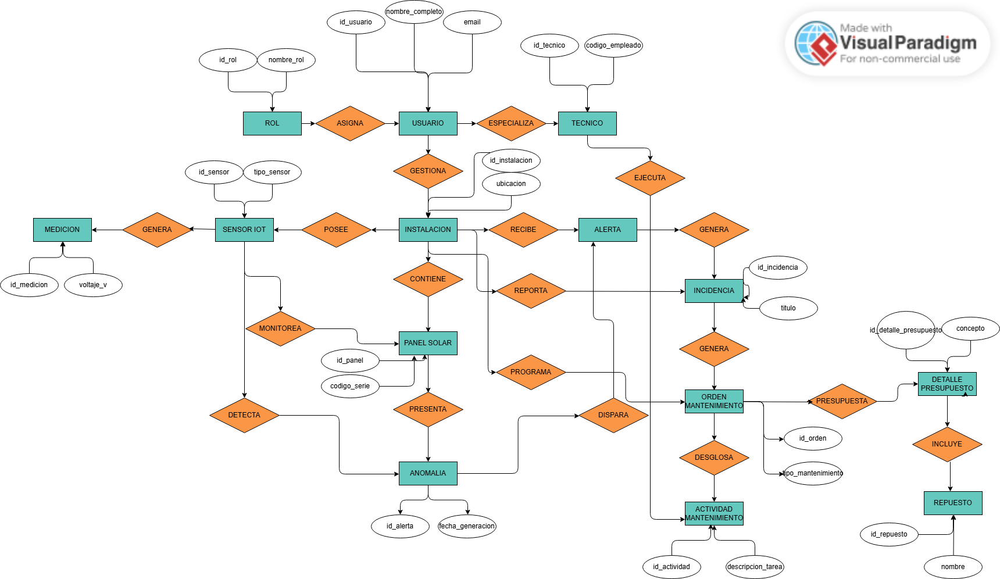
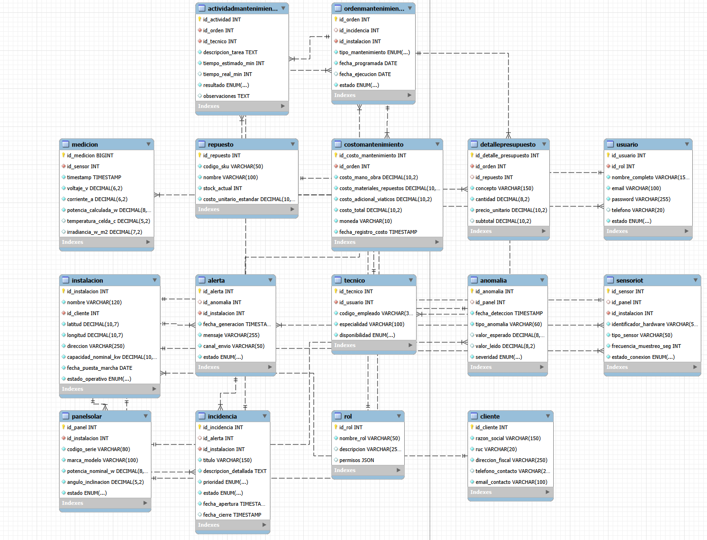

3. # **CAPÍTULO III: DISEÑO DE BASE DE DATOS** {#capítulo-iii:-diseño-de-base-de-datos}

   1. ## **Entidades** {#entidades}

      Realizamos el diseño de entidades para armas nuestras tablas necesarias y comenzar nuestro diagrama según los datos obtenidos de nuestros usuarios entrevistas y adaptando algunas tablas fundamentales que son pertinentes para el sistema.

      

| Usuario | Es necesaria para identificar a las personas que utilizan la plataforma y gestionar su acceso según el rol que desempeñen dentro de SolarPulse IoT. |
| :---- | :---- |
| Rol | Es importante para diferenciar los tipos de usuarios y controlar el acceso a la información y funcionalidades de acuerdo con los permisos asignados. |
| Instalación | Es fundamental porque representa el sistema fotovoltaico que será monitoreado por la plataforma. Permite centralizar la información relacionada con cada instalación solar. |
| Panel Solar | Es necesaria para identificar y controlar individualmente cada panel de una instalación, permitiendo detectar problemas específicos y conocer su rendimiento. |
| Sensor IoT | Es fundamental para obtener los datos provenientes de los paneles solares, permitiendo realizar el monitoreo de variables como voltaje, corriente y temperatura. |
| Medición | Es necesaria para almacenar los datos obtenidos por los sensores a lo largo del tiempo y permitir el análisis del comportamiento de los paneles. |
| Anomalía | Permite registrar las condiciones anormales detectadas a partir de las mediciones, facilitando la identificación temprana de posibles problemas. |
| Alerta | Es necesaria para comunicar oportunamente al usuario la detección de una condición anómala en un panel o instalación. |
| Incidencia | Permite registrar y realizar seguimiento a los problemas detectados que requieren una intervención o solución técnica. |
| Orden mantenimiento | Es necesaria para organizar y gestionar las actividades que deben realizarse para solucionar una incidencia detectada. |
| Tecnico | Permite identificar al responsable de realizar las intervenciones de mantenimiento y mantener trazabilidad sobre quién ejecutó cada trabajo. |
| Actividad mantenimiento | Es necesaria para registrar las acciones realizadas durante una intervención y conservar el historial de mantenimiento de la instalación o panel. |
| Repuesto | Permite controlar los componentes utilizados durante las actividades de mantenimiento y llevar un registro de los recursos empleados. |
| Detalle presupuesto | Es necesario registrar específicamente los repuestos utilizados en cada actividad de mantenimiento y relacionarlos con el trabajo realizado. |
| Cliente | Es necesaria para representar a las personas naturales o jurídicas propietarias de las instalaciones fotovoltaicas y gestionar su información fiscal y de contacto. |
| Costo mantenimiento | Permite registrar y controlar los costos asociados a las actividades de mantenimiento y a los repuestos utilizados, facilitando la trazabilidad económica. |

      

   2. ## **Atributos** {#atributos}

Los atributos definidos a continuación no han sido concebidos de manera aislada, sino que emergen del análisis exhaustivo y la síntesis de las necesidades detectadas en las entrevistas aplicadas a cada uno de nuestros segmentos objetivo (gestores comerciales, familias residenciales y evaluadores en transición energética). Cada campo ha sido rigurosamente seleccionado para responder a dolores específicos expresados por los usuarios “como la necesidad de auditar ahorros en soles, interpretar alertas en lenguaje no técnico, trazar costos de mantenimiento y supervisar la telemetría en tiempo real”. Este levantamiento de información garantiza que la estructura de datos sea 100% representativa de la operación real, sirviendo como base sólida y validada para la construcción del diagrama de entidad-relación lógico y la posterior implementación del sistema.

| Usuario |  |
| ----- | ----- |
| Atributos | Descripción |
| id\_usuario  | Identificador único.  |
| id\_rol  | Clave foránea que define los permisos y nivel de acceso  |
| nombre\_completo  | Nombre y apellidos del usuario.  |
| email  | Correo electrónico institucional o personal (usado para login y notificaciones).  |
| password | la contraseña.  |
| telefono  | Número de contacto para avisos de emergencia.  |
| estado  | Estado de la cuenta (activo, suspendido, inactivo).  |

| Rol  |  |
| ----- | ----- |
| Atributos | Descripción |
| id\_rol  | Identificador único del rol.  |
| nombre\_rol  | Nombre del rol  |
| descripcion  | Detalle del alcance y responsabilidades del perfil.  |
| permisos  | Conjunto o matriz de permisos del sistema (lectura, escritura, asignación de órdenes, etc.).  |

| Cliente |  |
| ----- | ----- |
| Atributos | Descripción |
| id\_cliente | Identificador único del cliente. |
| razon\_social | Nombre o razón social de la persona natural o jurídica propietaria. |
| ruc | Número de Registro Único de Contribuyente o documento de identidad. |
| direccion\_fiscal | Dirección del domicilio fiscal o legal del cliente. |
| telefono\_contacto | Número telefónico principal de contacto. |
| email\_contacto | Correo electrónico corporativo o personal para facturación y avisos. |

| Instalación  |  |
| ----- | ----- |
| Atributos | Descripción |
| id\_instalacion  | Identificador único de la instalación.  |
| nombre  | Nombre descriptivo de la planta o sede.  |
| id\_cliente  | Referencia al usuario o empresa propietaria.  |
| ubicacion\_lat | Coordenadas GPS (latitud, longitud) y dirección física.  |
| ubicacion\_long | Coordenadas GPS (latitud, longitud) y dirección física.  |
| direccion | ubicacion en calles  |
| capacidad\_nominal\_kw  | Potencia pico teórica total diseñada para la instalación (kWp).  |
| fecha\_puesta\_marcha  | Fecha de inicio de operaciones.  |
| estado\_operativo  | Estado general (operativa, en mantenimiento parcial, fuera de servicio).  |

| Panel Solar  |  |
| ----- | ----- |
| Atributos | Descripción |
| id\_panel  | Identificador único del panel.  |
| id\_instalacion  | Instalación a la que pertenece.  |
| codigo\_serie  | Número de serie del fabricante.  |
| marca\_modelo  | Fabricante y modelo técnico  |
| potencia\_nominal\_w  | Potencia nominal de diseño en vatios (Wp).  |
| angulo\_inclinacion  | Configuración física de montaje (azimut e inclinación).  |
| orientacion | orientacion(Norte,sur,este,oeeste) |
| estado  | Condición actual (óptimo, degradado, dañado, desconectado).  |

| Sensor IoT  |  |
| ----- | ----- |
| Atributos | Descripción |
| id\_sensor  | Identificador único del sensor.  |
| id\_panel  | Panel o inversor específico al que está acoplado (si aplica).  |
| id\_instalacion  | Instalación en la que opera.  |
| identificador\_hardware  | Identificador físico de red o dispositivo.  |
| tipo\_sensor  | Variable principal medida (corriente/voltaje DC, temperatura de celda, irradiancia solar, ambiental).  |
| mac\_address | identificador único  |
| frecuencia\_muestreo\_seg  | Intervalo de tiempo configurado entre cada telemetría.  |
| estado\_conexion  | Estado de conectividad (online, offline, batería baja).  |

| Medición  |  |
| ----- | ----- |
| Atributos | Descripción |
| id\_medicion  | Identificador único del registro de telemetría.  |
| id\_sensor  | Sensor emisor de la lectura.  |
| timestamp\_registro | Fecha, hora exacta y zona horaria de la captura.  |
| voltaje\_v  | Tensión eléctrica registrada.  |
| corriente\_a  | Intensidad de corriente registrada.  |
| potencia\_calculada\_w  | Potencia instantánea calculada |
| temperatura\_celda\_c  | Temperatura medida en la superficie del panel.  |
| irradiancia\_w\_m2  | Nivel de radiación solar capturada en el momento.  |

| Anomalía  |  |
| ----- | ----- |
| Atributos | Descripción |
| id\_anomalia  | Identificador único de la anomalía.  |
| id\_panel  | Componente donde se detectó el comportamiento inusual.  |
| id\_sensor | id del sensor |
| fecha\_deteccion  | Momento exacto en que el algoritmo o regla la identificó.  |
| tipo\_anomalia  | Categoría del fallo (hotspot, sombreado constante, degradación acelerada, circuito abierto).  |
| valor\_esperado  | Métricas de comparación para auditoría.  |
| valor\_leido  | Métricas de comparación para auditoría.  |
| severidad  | Nivel de criticidad (baja, media, alta, crítica).  |

| Alerta  |  |
| ----- | ----- |
| Atributos | Descripción |
| id\_alerta  | Identificador único de la alerta.  |
| id\_anomalia  | Anomalía que originó la alerta (si fue gatillada automáticamente).  |
| id\_instalacion  | Instalación afectada.  |
| fecha\_generacion  | Fecha y hora de emisión.  |
| mensaje  | Texto claro describiendo la advertencia.  |
| canal\_envio  | Vía de notificación empleada (SMS, correo, webhook, push).  |
| estado  | Ciclo de vida del aviso (no leída, atendida, silenciada).  |

| Incidencia  |  |
| ----- | ----- |
| Atributos | Descripción |
| id\_incidencia  | Identificador único de la incidencia (ticket).  |
| id\_alerta  | Alerta previa que derivó en la incidencia (opcional).  |
| id\_instalacion  | Instalación impactada.  |
| titulo  | : Resumen conciso del problema.  |
| descripcion\_detallada  | Contexto técnico de la falla reportada.  |
| prioridad  | Urgencia de resolución (baja, media, alta, urgente).  |
| estado  | Flujo de trabajo (abierta, en diagnóstico, en mantenimiento, resuelta, cerrada).  |
| fecha\_apertura  | Marcas de tiempo del ciclo de vida del ticket.  |
| fecha\_cierre  | Marcas de tiempo del ciclo de vida del ticket.  |

| Orden de Mantenimiento  |  |
| ----- | ----- |
| Atributos | Descripción |
| id\_orden  | Identificador único de la orden de trabajo (OT).  |
| id\_incidencia  | Incidencia asociada (si es correctivo).  |
| id\_instalacion  | Ubicación donde se efectuará el trabajo.  |
| tipo\_mantenimiento  | Clasificación del trabajo (preventivo, correctivo, predictivo/limpieza).  |
| fecha\_programada  | Fecha estimada para la ejecución.  |
| fecha\_ejecucion  | Fecha real de intervención.  |
| estado  | Estado de la OT (pendiente, asignada, en progreso, completada, cancelada).  |

| Técnico  |  |
| ----- | ----- |
| Atributos | Descripción |
| id\_tecnico  | Identificador único del técnico.  |
| id\_usuario  | Vínculo con la entidad Usuario para login y credenciales.  |
| codigo\_empleado  | Acreditación profesional o certificación técnica.  |
| especialidad  | Área de dominio (alta tensión, montaje mecánico, redes IoT, instrumentación).  |
| disponibilidad  | Estado laboral actual (disponible, en ruta, en servicio, de baja).  |

| Actividad de Mantenimiento  |  |
| ----- | ----- |
| Atributos | Descripción |
| id\_actividad  | Identificador único de la tarea.  |
| id\_orden  | Orden de mantenimiento a la que pertenece.  |
| id\_tecnico  | Técnico responsable de ejecutar la tarea.  |
| descripcion\_tarea  | Procedimiento específico realizado.  |
| tiempo\_estimado\_min  | Duración de la actividad para control de horas hombre.  |
| tiempo\_real\_min  | Duración de la actividad para control de horas hombre.  |
| resultado  | Resultado de la acción (exitosa, incompleta, requiere segunda visita).  |
| observaciones  | Comentarios técnicos adicionales o hallazgos secundarios.  |

| Repuesto  |  |
| ----- | ----- |
| Atributos | Descripción |
| id\_repuesto  | Identificador único del componente.  |
| codigo\_sku  | Código de inventario o catálogo del fabricante.  |
| nombre  | Denominación del repuesto (ej. fusible DC 15A, cable solar 4mm², conector MC4).  |
| stock\_actual  | Cantidad de unidades disponibles en bodega.  |
| costo\_unitario\_estandar  | Valor unitario monetario del ítem.  |

| Detalle de Presupuesto  |  |
| ----- | ----- |
| Atributos | Descripción |
| id\_detalle\_presupuesto  | Identificador de la partida o renglón.  |
| id\_orden  | Orden de trabajo a la que se cotiza.  |
| id\_repuesto  | Repuesto cotizado (nullable si es mano de obra o servicio).  |
| concepto  | Descripción del ítem presupuestado (ej. "Reemplazo de conectores MC4")  |
| cantidad  | Unidades o número de horas cotizadas.  |
| precio\_unitario  | Tarifa aplicada por unidad.  |
| subtotal  | Total calculado ($cantidad\times precio\_unitario$).  |

| Costo Mantenimiento  |  |
| ----- | ----- |
| Atributos | Descripción |
| id\_costo\_mantenimiento  | Identificador del cierre contable de la orden.  |
| id\_orden  | Orden de trabajo liquidada.  |
| costo\_mano\_obra  | Suma acumulada de las horas hombre de los técnicos.  |
| costo\_materiales\_repuestos  | Gasto real en piezas y consumibles utilizados  |
| costo\_adicional\_viaticos  | Gastos por traslado, grúas o equipamiento de seguridad.  |
| costo\_total  | Suma total monetaria liquidada para la orden.  |
| moneda  | Código monetario de facturación (USD, PEN, EUR, etc.).  |
| fecha\_registro\_costo  | Fecha en que se cerró y aprobó la liquidación.  |

En conclusión, la selección de atributos para cada entidad responde de forma directa a las necesidades identificadas en las entrevistas de cada segmento objetivo. Esta estructura no solo garantiza la captura de datos clave para la gestión técnica y económica, sino que también asegura la consistencia y solidez necesarias para el desarrollo del modelo lógico.

3. ## **Enfoque relacional** {#enfoque-relacional}

   El diagrama entidad-relación conceptual utiliza la notación de Chen para representar de manera clara y visual las entidades, atributos y relaciones derivadas de las entrevistas. Se eligió esta notación debido a su alta claridad conceptual y su énfasis en los atributos y la naturaleza de las relaciones binarias y numéricas, lo que facilita la comprensión inicial del modelo antes de pasar al diseño lógico y físico.  
     
      

     
   

   1. ### Diagrama entidad-relación lógico  {#diagrama-entidad-relación-lógico}

      El diagrama de entidad-relación lógico constituye la representación estructurada de la arquitectura de datos del sistema SolarPulse IoT. En esta etapa, el modelo integra detalladamente los atributos identificados y definidos previamente (tales como datos de identificación personal, credenciales, correos electrónicos y parámetros operativos técnicos entre otros), estableciendo las claves primarias y foráneas que formalizan las dependencias y tipos de relación entre cada entidad. Esta especificación lógica permite validar la coherencia conceptual de la información antes de proceder con el diseño e implementación de la base de datos a nivel físico.
      
      

